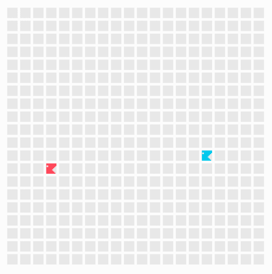
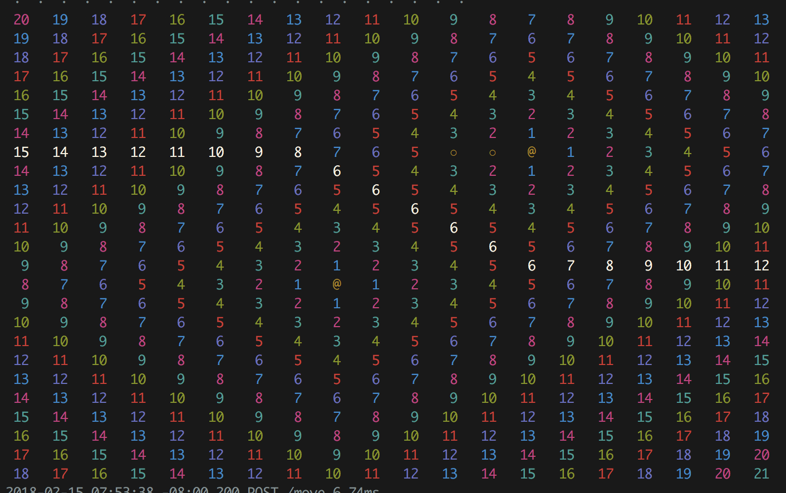
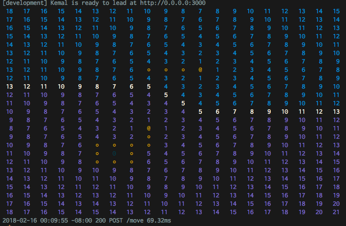
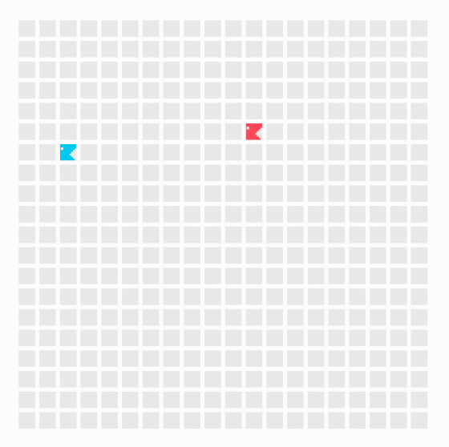

# Battlesnake in Crystal

Tron-style [Battlesnake](https://www.battlesnake.io/) written in [Crystal](https://crystal-lang.org/).



Blue: Crystal snake using Voronoi; Red: Ruby snake using DFS

# Challenge

As a sponsor in the [Battlesnake](https://www.battlesnake.io/) event, each company is tasked with creating a _bounty snake_ that participants can challenge for a potential prize. The variant we chose was a _tron-styled game_ where the tail of the snake remains stationary and no food is available. 

# Why Crystal?

It's compiled! It's typed! It's fast! Also my background is in Ruby and Elixir. This was my first time using Crystal.

---

# Strategy

There are two phases:

1. **Voronoi Analysis**: maxmizing the area controlled by my snake

2. **Survival Mode**: using remaining space as efficiently and compactly as possible

**Survival mode** is triggered once my snake is in a closed area, which was determined using [Two Pass Connected Component](https://en.wikipedia.org/wiki/Connected-component_labeling#Two-pass) analysis. Code [here](src/battlesnake_crystal/connected_components.cr).

## 1. Voronoi Analysis

### Voronoi Heuristic

The voronoi heuristic is useful for determining _how much area a user controls_. The basic premise is to use a flood fill algorithm (or however you want to do it) to find the minimum distance required for a snake to reach a point on the grid. In the case of two snakes, a border will exist between them (where the snakes reach a point on the grid at the same time).  

Voronoi for two snakes (white is shared distances):


Visualization of the area controlled by each snake:


### Using Voronoi

Applying the voronoi heuristic once isn't actually that useful. Here's the recipie for the magic sauce:

1. From the head of my snake, determine all the farthest paths it can take. In practice, there are too many possible paths to compute in a reasonable time. Instead find all paths up to distance X away. In my case, X=3 but can be changed via an environment variable. So to rephrase, **find all paths up to 3 steps away from my snake's head**. 

2. **Reapply the voronoi heuristic for each of the possibe paths that my snake can take (from step 1).**

3. **Choose the path that results with my snake having the most controlled area.**

Note: It's worth acknowledging that I'm only accounting for where my snake moves, without considering the movements of other snakes on the grid. 

## 2. Survival Mode

Survival mode is super simple. Check all the points around my snake's head and go in the direction of the one that has the fewest open spaces next to it. This basically forces the snake to hug it's body and/or hug walls. Code [here](src/battlesnake_crystal/survival_snake.cr).

---

# Usage

This part is for me.

## Installation

Install Crystal off the website or just use:

```
brew update
brew install crystal-lang
```

Then to install deps run:

`crystal deps`

For hotcode reloading, install [sentry](https://github.com/samueleaton/sentry).

Then call: `./sentry` from the project directory to run it with hot reloading.

Otherwise, to run the server, run:

`crystal src/battlesnake_crystal.cr`

## Battlesnake stuff:

There is an example start request in: start.json

There is an example move request in: move.json

## Issues

If you run into a libssl issue, try:
`https://github.com/crystal-lang/crystal/issues/4745#issuecomment-332553374`

---

# Thanks

Thanks to my coworkers, especially Ian Clarkson for being a soundboard for ideas and feedback. 

Thanks to AppColony for the chance to participate in the event as a sponsor (thanks Aaron!).

Special thanks to [A1k0n](https://www.a1k0n.net/2010/03/04/google-ai-postmortem.html) who's article was the inspiration to use a [Voronoi diagram](https://en.wikipedia.org/wiki/Voronoi_diagram) approach. 

# More screenshots




